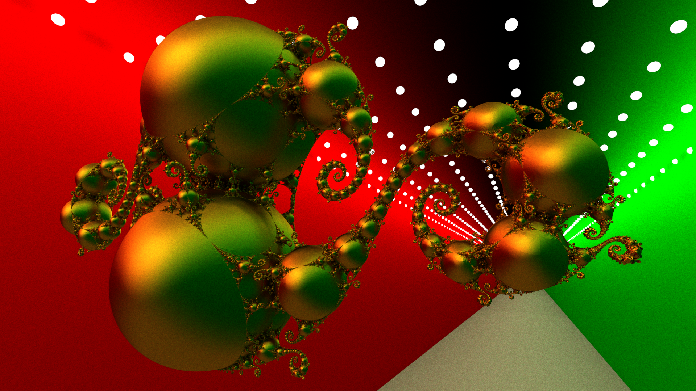
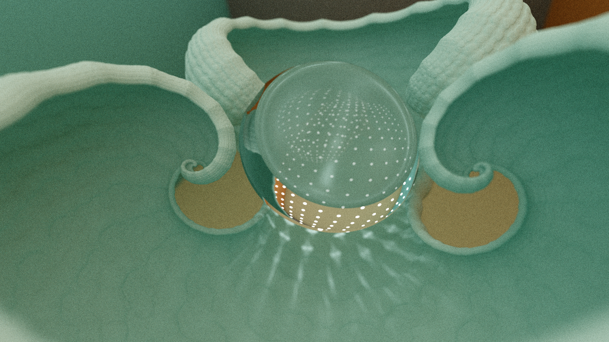

# Built on [NQADE](https://github.com/0xBAMA/not-quite-a-demo-engine)

## Setup
- Requires `libsdl2-dev` on Ubuntu.
- Make sure to recurse submodules to pull in FastNoise2 code - `git submodule update --init --recursive`, alternatively just run scripts/init.sh to do the same thing. FastNoise2 may be removed, as I don't think it's particularly relevant to this project.
- Run scripts/build.sh in order to build on Ubuntu. It just automates the building of the executable and moves it to the root directory, as files are referenced relative to that location, and then deletes the build folder (if called with the "clean" option).

# Siren
Siren is a rewrite of SDF_Path using NQADE

Some areas to improve / mess around with:

- ~~Timing on tile rendering loop, to keep things responsive - this wasn't working on the last implementation, needs work - probably use OpenGL timing queries instead of std::chrono, that might be all I need to do~~ This keeps the main loop under 16ms, giving 60fps updates of the ImGUI interface and input handling. By doing this, interactivity of the interface is maintained.

- Finish implementing dither and tonemapping logic - port [this color space](https://bottosson.github.io/posts/colorpicker/) and see if there's any other interesting ones - look at local tonemapping, and see if I can implement something like this as well.
- Maybe some other postprocessing effects like fft bloom.
- The glitch logic I outlined in my notes:
	- Pull image data to CPU or do in a shader and write back to the accumulator texture
		- Masking for application of the following effects
		- Add to color channels or masking by glyph stamps ( randomly additive or subtractive )
			- Change the included utility from hoard-of-bitfonts to bitfontCore, for the compressed format of the bitfont glyphs
		- Blurs
		- Clears ( every other row / checkerboard )
		- Dither inside tile
		- Reset averaging ( sample count )
		- Use std::vector + shuffle to on an array of floats cast to a byte array - make a mess of it, but check for NaN's in the data before re-sending to keep from having issues from that
